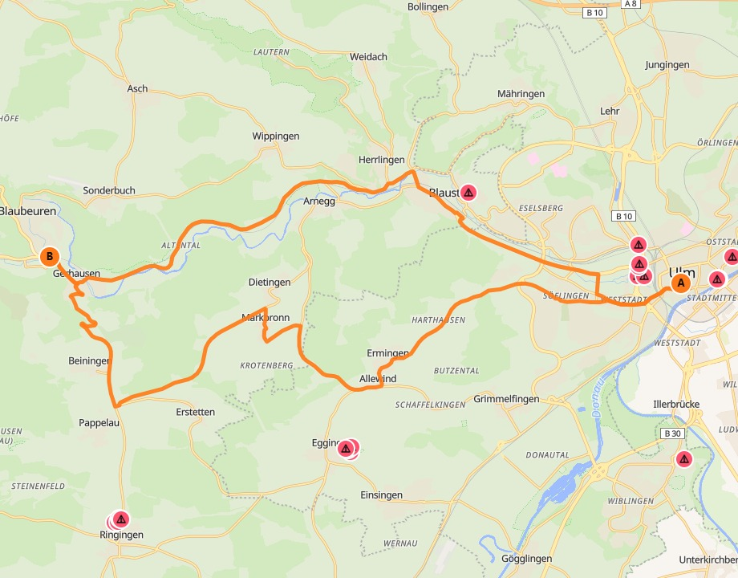

# 🏍️ Motorrad-Routenplaner

Open-Source Web-App zum Planen von Motorradtouren: Route von A nach B (optional als
Rundtour), beliebig viele Zwischenziele – per **Eingabefeld** (Adresse/Ort tippen)
oder Karten-Klick gesetzt, Start optional per **aktuellem Standort**. Profil
**Schnell / Kurvig / Autobahn** wahlweise global **oder pro Abschnitt** zwischen zwei
Wegpunkten (Kurvig meidet Städte & Dörfer, Autobahn ist am schnellsten); **Distanz und
Fahrzeit je Teilstrecke** werden direkt am Wegpunkt angezeigt. Vermeidung aktueller
**Baustellen** (einklappbares Menü, einzeln übersteuerbar), Auswahl von
**Restaurants/Imbissen und Tankstellen** entlang der Strecke und **GPX-Export** für
Navi/Handy (OsmAnd, Calimoto, Garmin …). Gesamt-Distanz, Fahrzeit und Export liegen in
einer **Statusleiste unter der Karte**. Große, zoombare Karte.

Alles basiert auf Open-Source-Bausteinen und offenen Daten (OpenStreetMap, BRouter,
MapLibre, OpenFreeMap, Overpass, Nominatim, Autobahn-GmbH-API).

## Screenshot



*Rundtour Ulm (A) ↔ Blaubeuren (B): links die Wegpunkte als Eingabefelder mit
⚡/🌀-Umschalter je Teilstrecke, Profil-Vorgabe und Baustellen-Optionen; rechts die
kurvige Route auf der Karte; unten die dauerhafte Statusleiste mit Distanz, Fahrzeit
und GPX-Export.*

## Architektur

```
Browser (React + MapLibre)
   │  REST  (/api/*)
   ▼
Backend (Node/Fastify)  ──►  BRouter (Routing-Engine)
   ├─ /api/route       Profil(e) hochladen + nogo-Sperrzonen + Routing (pro Abschnitt)
   ├─ /api/geocode     Adresssuche (Nominatim)
   ├─ /api/reverse     Standort -> Adresse (Nominatim, „aktueller Standort")
   ├─ /api/roadworks   Baustellen (Autobahn-GmbH-API + OSM/Overpass)
   ├─ /api/pois        Restaurants/Imbisse + Tankstellen im Puffer (Overpass)
   └─ /api/gpx         Track + Wegpunkte -> GPX-Datei
```

## Einfachster Start: fertige Windows-EXE 🪟

Eine einzige Datei, kein Node/Docker/Terminal nötig:

```bash
npm install
npm run package:win
```

Das erzeugt **`desktop/Routenplaner.exe`**. Doppelklick startet die App und öffnet
automatisch den Browser (`http://localhost:8080`). Die EXE enthält Backend, Frontend
und die Profile; fürs Routing wird standardmäßig die öffentliche BRouter-Instanz
genutzt (kein Setup von Routing-Daten nötig).

> Hinweise:
> - Beim ersten Start meldet sich evtl. der Windows-SmartScreen („Unbekannter
>   Herausgeber"), weil die EXE nicht signiert ist → *Weitere Informationen → Trotzdem
>   ausführen*.
> - Zum Beenden einfach das Konsolenfenster schließen.
> - Eigene Einstellungen (z. B. selbst gehosteten BRouter) per Umgebungsvariablen,
>   etwa `set BROUTER_URL=http://localhost:17777/brouter` vor dem Start.

Fertige EXEs gibt es als Download unter
[Releases](https://github.com/mzluzifer/motorrad-routenplaner/releases). Ein
GitHub-Actions-Workflow ([`.github/workflows/build-exe.yml`](.github/workflows/build-exe.yml))
baut die EXE bei jedem neuen Versions-Tag (`v*`) automatisch und hängt sie ans Release.

## Schnellstart (ohne Docker, zum Ausprobieren)

Nutzt die **öffentliche** BRouter-Instanz – kein Setup von Routing-Daten nötig.

```bash
npm install

# Backend: öffentliche BRouter-Instanz verwenden
cd backend
# .env anlegen (siehe .env.example) ODER Variablen direkt setzen:
#   BROUTER_URL=https://brouter.de/brouter
#   CONTACT_EMAIL=deine@echte-mail.de   (NICHT example.com – das blockt Nominatim!)
npm run dev

# In einem zweiten Terminal: Frontend
cd frontend
npm run dev      # http://localhost:5173
```

Oder beides zusammen vom Projekt-Root: `npm run dev`
(setze vorher `BROUTER_URL`/`CONTACT_EMAIL` in `backend/.env`).

## Voller Betrieb (selbst gehostetes Routing per Docker)

Für volle Kontrolle über die Profile und unabhängig von öffentlichen Limits.

1. **Routing-Daten herunterladen** – die rd5-Kacheln für dein Fahrgebiet von
   <https://brouter.de/brouter/segments4/> nach `./brouter-data/segments4/` legen
   (z. B. `E5_45.rd5`, `E10_45.rd5` für Süddeutschland).

2. **Starten:**
   ```bash
   docker compose up --build
   ```
   - BRouter läuft auf `:17777`, Backend auf `:8080`.
   - Frontend separat: `npm run dev:frontend` (Vite proxyt `/api` ans Backend).

   Das Backend ist im Compose bereits auf `BROUTER_URL=http://brouter:17777/brouter`
   gesetzt. Trage in der `backend`-Umgebung deine echte `CONTACT_EMAIL` ein.

## Routenprofile

Die Profile liegen als BRouter-Dateien in `backend/brouter-profiles/`:

- **`moto-fast.brf`** – bevorzugt schnelle, durchgängige Straßen, bestraft Zickzack.
- **`moto-curvy.brf`** – bevorzugt kurvige Land-/Nebenstraßen, niedrige Abbiegekosten,
  und **meidet Ortschaften** über hohe Kosten für `residential` / `living_street` /
  `service`. So führt die Route nicht durch Dörfer, nur weil es dort kurvig aussieht.
- **`moto-autobahn.brf`** – Autobahn/Schnellstraße klar bevorzugt, kleinere Straßen nur
  als Zubringer. Für die schnellstmögliche Verbindung.

Die Zahlenwerte sind bewusst einfach gehalten und können in den `.brf`-Dateien
nachjustiert werden. Das Backend lädt das jeweilige Profil automatisch zum
BRouter-Server hoch und referenziert es beim Routing.

**Profil pro Abschnitt:** In der App lässt sich das Profil nicht nur global (als
Vorgabe für alle Teilstrecken) setzen, sondern zwischen je zwei Wegpunkten einzeln
auf ⚡ Schnell, 🌀 Kurvig oder 🛣️ Autobahn stellen. Das Backend routet jeden Abschnitt
einzeln über BRouter, fügt die Teilstücke zu einem durchgehenden Track zusammen und
liefert dabei **Distanz und Fahrzeit je Teilstrecke** (auch der Rückweg bei Rundtour
ist eigen einstellbar). Die Werte erscheinen direkt am jeweiligen Wegpunkt.

## Baustellen

`/api/roadworks` aggregiert für den Routenbereich:

- **Autobahn-GmbH-API** – zuverlässige Echtzeit-Baustellen auf Autobahnen (gecacht).
- **OSM/Overpass** (`highway=construction`) – auch Land-/Nebenstraßen, Datenlage
  jedoch lückenhaft und nicht immer top-aktuell (per Schalter abschaltbar).

In der App: ein **einklappbares Baustellen-Menü** mit globalem Schalter
**„Baustellen meiden"** plus pro Baustelle ein Häkchen, um einzelne Baustellen doch zu
befahren. Aktive Baustellen werden als BRouter-`nogo` übergeben, sodass die Route außen
herum führt.

## Einkehr (Restaurants/Imbisse) & Tankstellen

Nach der Routenberechnung „Entlang der Strecke suchen" – findet `restaurant`,
`fast_food` und `cafe` im 500-m-Puffer um die Route (Overpass). Auswahl fügt den Ort
als Zwischenziel ein, die Route wird neu berechnet. Analog gibt es eine
**Tankstellen-Suche** (`amenity=fuel`): reale, benannte Tankstellen aus OpenStreetMap
mit Marke und Distanz zur Route, ebenfalls per Klick als Zwischenziel einfügbar.

**Qualität/„Sterne":** Echte Nutzer-/Google-Bewertungen gibt es in offenen Daten
nicht. Statt einer (kostenpflichtigen, proprietären) Google-Places-Anbindung wird die
**Vollständigkeit der OSM-Tags** (Öffnungszeiten, Website, Küche, Adresse …) als
0–5-„Qualität" dargestellt. Gut gepflegte Einträge gelten als „verifiziert"; ein
Schieberegler filtert auf eine Mindest-Qualität (Vorgabe 4,5). Das ist transparent
**keine** echte Bewertung, sondern ein Datenqualitäts-Indikator.

## Routeninformation (Statusleiste)

Distanz, Fahrzeit (geschätzt) und der **GPX-Export** liegen dauerhaft in einer
Statusleiste **unter der Karte** – immer sichtbar, unabhängig vom Scrollzustand der
Seitenleiste.

## Konfiguration (Backend, `.env`)

| Variable        | Bedeutung                                   | Default |
|-----------------|---------------------------------------------|---------|
| `PORT`          | Backend-Port                                | `8080` |
| `BROUTER_URL`   | BRouter-Endpunkt                            | `http://localhost:17777/brouter` |
| `OVERPASS_URL`  | Overpass-API (kommt in der Fallback-Kette zuerst) | `https://overpass-api.de/api/interpreter` |
| `NOMINATIM_URL` | Geocoding                                   | `https://nominatim.openstreetmap.org` |
| `AUTOBAHN_URL`  | Autobahn-GmbH-API                           | `https://verkehr.autobahn.de/o/autobahn` |
| `CONTACT_EMAIL` | Kontakt im User-Agent (Fair-Use)            | – |

> **Wichtig:** Nominatim blockt User-Agents mit `example.com`. Trage eine echte
> Kontakt-Adresse ein, sonst schlägt die Adresssuche mit `403` fehl.

> **Fair-Use:** Die öffentlichen Overpass-/Nominatim-Instanzen haben Nutzungslimits.
> Für regelmäßige/intensive Nutzung später eigene Instanzen hosten und die URLs
> in der `.env` anpassen.

> **Overpass-Ausfallsicherheit:** Die POI-/Tankstellen- und OSM-Baustellen-Abfragen
> laufen über eine **Fallback-Kette** mehrerer öffentlicher Overpass-Server. Ist einer
> nicht erreichbar oder überlastet, wird automatisch der nächste versucht; der zuletzt
> erfolgreiche wird bevorzugt. Sind ausnahmsweise alle überlastet, kommt eine klare
> Meldung statt eines kryptischen „fetch failed".

## Tech-Stack

React · TypeScript · Vite · MapLibre GL · OpenFreeMap · Fastify · Turf.js · BRouter ·
OpenStreetMap (Overpass, Nominatim) · Autobahn-GmbH-API.
